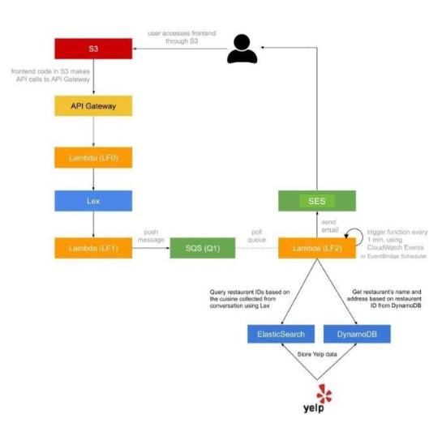

# Restaurant Bot

We have implemented a serverless and microservice-driven web chatbot. This chatbot will send the user restaurant suggestions, given a set of preferences provided to the chatbot during the conversation.

## Architecture

## Usage

This chatbot pulls its restaurant information from Yelp, and so we have restricted the types of recommendations the chatbot can provide. 

For types of cuisine, we have given the user flexibility on the options available. The user can choose between: Italian, Chinese, Indian, American, Mexican, Spanish, Greek, Japanese. 
For locations, the user is restricted to either Manhattan or New York.

For the number of people in the party, we have restricted this number to be a reasonable one for New York restaurants. The maximum number of people the user is able to include is 20. The user is also prompted to include at least one person, when asked how many people are in their party. 

For the time that the user would like to dine, we again have restricted this to reasonable times. So, we have restricted the time a user can input to dine to be reasonable business hours between 10AM and 9PM. 

## Team Members

- Aakar Mutha (am13480@nyu.edu)
- Margaret Jagger (mj3102@nyu.edu)